<div align="center">


<br/>


</div>

</div>

<a id="arcade"></a>

## `[ 01 ]` ARCADE

<div align="center">



<br/>

<sub>Self-contained SVG. A heuristic AI plays a full match — the board, the AI and the animation are baked in at build time.</sub>

</div>

<a id="profile"></a>

## `[ 02 ]` PLAYER_PROFILE

```ts
const jhinta = {
  role      : "Frontend Developer & AI Engineer",
  studying  : "Universidad Peruana de Ciencias Aplicadas",
  focus     : "Modern TETRIS — stacking, finesse & speed",
  contact   : "jhinta7@gmail.com",
  interests : ["video games", "technology", "modern tetris"],
  motto     : "Ship clean. Stack clean.",
} as const;
```

<a id="stack"></a>

## `[ 03 ]` TECH_STACK

<table>
<tr><td><b>&nbsp;I&nbsp;</b></td><td><b>&nbsp;CORE&nbsp;</b></td><td>


</td></tr>
<tr><td><b>&nbsp;J&nbsp;</b></td><td><b>&nbsp;LANGS&nbsp;</b></td><td>


</td></tr>
<tr><td><b>&nbsp;L&nbsp;</b></td><td><b>&nbsp;FRONT&nbsp;</b></td><td>


</td></tr>
<tr><td><b>&nbsp;S&nbsp;</b></td><td><b>&nbsp;BACK&nbsp;</b></td><td>


</td></tr>
<tr><td><b>&nbsp;Z&nbsp;</b></td><td><b>&nbsp;DATA&nbsp;</b></td><td>


</td></tr>
<tr><td><b>&nbsp;O&nbsp;</b></td><td><b>&nbsp;INFRA&nbsp;</b></td><td>


</td></tr>
<tr><td><b>&nbsp;T&nbsp;</b></td><td><b>&nbsp;AI&nbsp;/&nbsp;TOOLS&nbsp;</b></td><td>


</td></tr>
</table>

<a id="scoreboard"></a>

## `[ 04 ]` SCOREBOARD

<div align="center">


</div>

<a id="grid"></a>

## `[ 05 ]` CONTRIBUTION_GRID

<div align="center">


</div>

<a id="connect"></a>

## `[ 06 ]` CONNECT

<div align="center">

<a href="https://www.linkedin.com/in/tyrone-sotil/"></a>
<a href="mailto:jhinta7@gmail.com"></a>
<a href="https://github.com/Tyrone-J"></a>


</div>